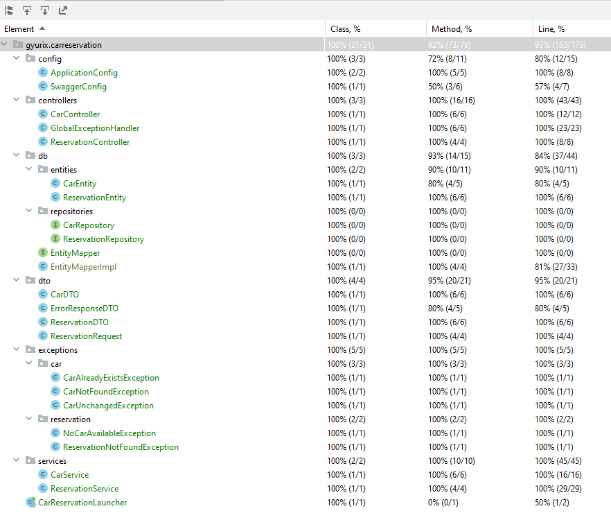

# Car Reservation API

## Description

The **Car Reservation API** allows users to reserve cars for upcoming rides.
Users can add cars, update them, remove them, or retrieve a list of all cars.
Reservations can be made for a specific time and duration, up to **24 hours**
in advance with a maximum duration of **2 hours**. These durations are configurable.

The system finds an available car, stores the reservation, and provides response details.

Communication is done via JSON format, and data is stored in memory without user-specific accounts.

## Building and Starting the Project

### Maven

To build and start the project using Maven:

1. Ensure Maven is installed.
2. Open a command line or terminal.
3. Navigate to the project root.
4. Run `mvn clean install -DskipTests -Dmaven.javadoc.skip=true` to build the project
5. Run `mvn spring-boot:run` to start the application.

### Docker

To build and start the project using Docker:

1. Ensure Docker is installed.
2. Open a command line or terminal.
3. Navigate to the project root.
4. Run `docker build -t car-reservation-api .` to build the Docker image.
5. Run `docker run -p 8080:8080 car-reservation-api` to start the application.

## Testing and documentation

### Running unit and integration tests
1. Ensure Maven is installed.
2. Open a command line or terminal.
3. Navigate to the project root.
4. Run `mvn clean install` to launch all the unit & integration tests

### Test coverage

### Swagger Page

The Car Reservation API provides a Swagger page to document and be able to
easily manually test the available endpoints.

Access the Swagger page by opening [https://127.0.0.1:8080/](https://127.0.0.1:8080/).

### Generating and Opening JavaDoc

JavaDoc is a documentation generation tool for Java code, providing detailed information about classes,
methods, and more. It helps document and understand the Car Reservation API effectively.

To generate and open the JavaDoc for the Car Reservation API:

1. Ensure Maven is installed.
2. Open a command line or terminal.
3. Navigate to the project root.
4. Run `mvn javadoc:javadoc` to generate the JavaDoc.
5. Open `target/site/apidocs/index.html` in a web browser.
